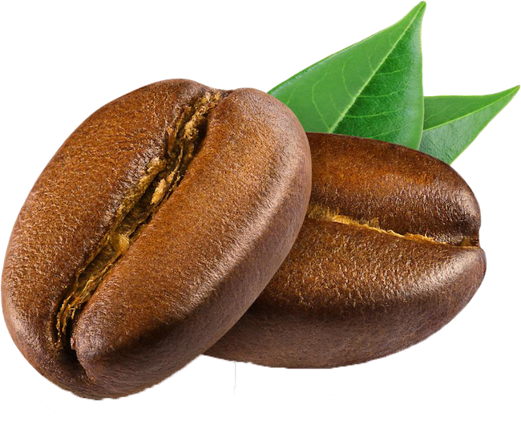

<!--
repo name: roast-meter
description: DIY roast meter guide
github name:  Juztins-Lab
link: https://github.com/juztins-lab/roast-meter
logo path: assets/logo.png
screenshot: 
twitter: your_username
email: justin@skitlabs.net
-->

<!-- PROJECT SHIELDS -->
[![Contributors][contributors-shield]][contributors-url]
[![Forks][forks-shield]][forks-url]
[![Stargazers][stars-shield]][stars-url]
[![Issues][issues-shield]][issues-url]
[![MIT License][license-shield]][license-url]
<!-- [![LinkedIn][linkedin-shield]][linkedin-url] -->

<!-- PROJECT LOGO -->
 

    
<h3 align="center"><a href="https://github.com/juztins-lab/roast-meter">Roast Meter</a></h3>
    

        An awesome DIY projects that will help you get better consistent roasts by measuring roast color between batches
         
         
        <a href="https://github.com/juztins-lab/roast-meter/issues">Report Bug</a>
        •
        <a href="https://github.com/juztins-lab/roast-meter/issues">Request Feature</a>
    

<!-- TABLE OF CONTENTS -->
## Table of Contents

- [Table of Contents](#table-of-contents)
- [About The Project](#about-the-project)
  - [Built With](#built-with)
- [Getting Started](#getting-started)
  - [Prerequisites](#prerequisites)
  - [Installation](#installation)
- [Usage](#usage)
- [Roadmap](#roadmap)
- [Contributing](#contributing)
- [License](#license)
- [Contact](#contact)

<!-- ABOUT THE PROJECT -->
## About The Project

Starting into home roasting I've quickly realised the importance of a roast meter to evaluate the color of the coffee, this helps you better target different end temperature/time but retain the same level of color and see how it influences taste.

Here's why:
* Commercial grade roast meters are very expensive
* Chips and sensors are are readily available/cheap and easy to get going
* At the end of the guide you will have an ~100$ roast meter, that is consistent and can help you get the most out of your roast.

A list of commonly used resources that I find helpful are listed in the acknowledgements.

### Built With
* [arduino]()

<!-- GETTING STARTED -->
## Getting Started
* Download the source files
* Get your hardware
* Print your 3d case

### Prerequisites

## Hardware
* [Artemis Thing Plus](https://www.sparkfun.com/products/15574)
* [MAX 30101 Sensor](https://www.sparkfun.com/products/16474)
* [Micro OLED](https://www.sparkfun.com/products/14532)
* 2x [50mm QWIIC Cables](https://www.sparkfun.com/products/14426)
* 1x [100mm QWIIC Cables](https://www.sparkfun.com/products/14427)
* [USB-C to PC Cable](https://www.sparkfun.com/products/14743)

## Software
* [Arduino IDE](https://www.arduino.cc/en/software)
* [Micro OLED Library](https://github.com/sparkfun/SparkFun_Micro_OLED_Arduino_Library/archive/refs/heads/main.zip)
* [MAX30101 Library](https://github.com/sparkfun/SparkFun_MAX3010x_Sensor_Library/archive/refs/heads/master.zip)

### Installation

## Assembly
* Guide coming soon

## Script install
* Install the Arduino IDE software that you just downloaded.
* Open Arduino IDE
* Load the "roast_meter.ino" file from the src folder.
* Add the board manager url in preferences [guide](https://learn.sparkfun.com/tutorials/artemis-development-with-arduino?_ga=2.2886777.830565863.1676798314-1161989038.1673857417)
* Load the 2 libriaries downloaded above using this [guide] (https://learn.sparkfun.com/tutorials/installing-an-arduino-library)
* At this point you should have already selected the board as "Artemis Thing Plus" and be able to deploy it to your hooked up device.
* Press "Verify" button on the Arduino IDE and if all went well, press "Upload" and your all done, the display should start up and you can begin measuring your roast level.

<!-- USAGE EXAMPLES -->
## Usage
* Guide coming soon

<!-- ROADMAP -->
## Roadmap
* ~~Calibration against Agtron Gourmet Scale~~ (DONE)
* Add battery, on/off button

See the [open issues](https://github.com/juztins-lab/roast-meter/issues) for a list of proposed features (and known issues).

<!-- CONTRIBUTING -->
## Contributing

Contributions are what make the open source community such an amazing place to be learn, inspire, and create. Any contributions you make are **greatly appreciated**.

1. Fork the Project
2. Create your Feature Branch (`git checkout -b feature/AmazingFeature`)
3. Commit your Changes (`git commit -m 'Add some AmazingFeature'`)
4. Push to the Branch (`git push origin feature/AmazingFeature`)
5. Open a Pull Request

<!-- LICENSE -->
## License

Distributed under the GNU License. See `LICENSE` for more information.

<!-- CONTACT -->
## Contact

Juztin - roastmeter@skitlabs.net

Project Link: [https://github.com/juztins-lab/roast-meter](https://github.com/juztins-lab/roast-meter)

<!-- MARKDOWN LINKS & IMAGES -->
<!-- https://www.markdownguide.org/basic-syntax/#reference-style-links -->
[contributors-shield]: https://img.shields.io/github/contributors/juztins-lab/roast-meter.svg?style=flat-square
[contributors-url]: https://github.com/juztins-lab/roast-meter/graphs/contributors
[forks-shield]: https://img.shields.io/github/forks/juztins-lab/roast-meter.svg?style=flat-square
[forks-url]: https://github.com/juztins-lab/roast-meter/network/members
[stars-shield]: https://img.shields.io/github/stars/juztins-lab/roast-meter.svg?style=flat-square
[stars-url]: https://github.com/juztins-lab/roast-meter/stargazers
[issues-shield]: https://img.shields.io/github/issues/juztins-lab/roast-meter.svg?style=flat-square
[issues-url]: https://github.com/juztins-lab/roast-meter/issues
[license-shield]: https://img.shields.io/github/license/juztins-lab/roast-meter.svg?style=flat-square
[license-url]: https://github.com/juztins-lab/roast-meter/blob/master/LICENSE.txt
[product-screenshot]: images/screenshot.png
